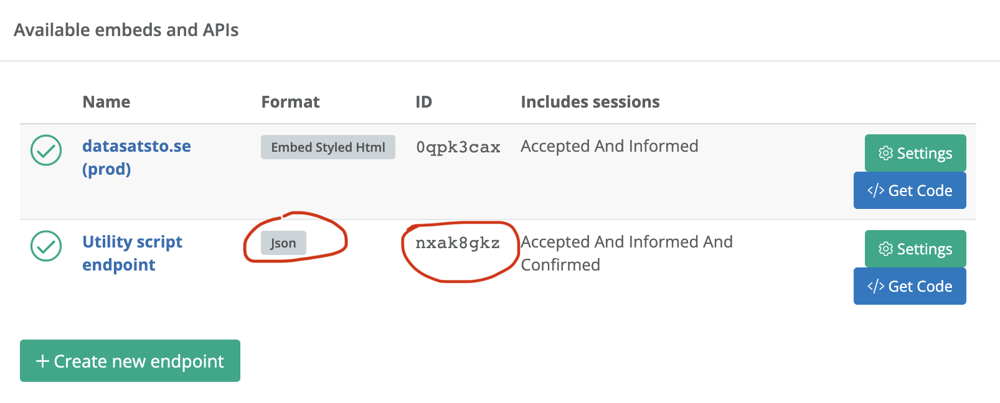
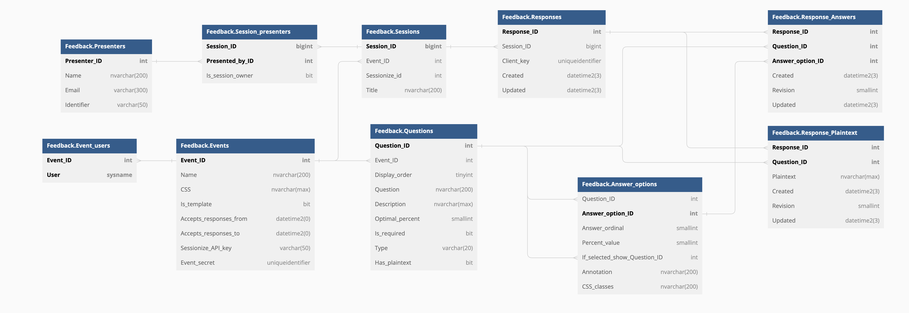

# Electronic conference session evaluation utility

I've designed an electronic solution to replace paper-based session
evaluations for conference attendees.

Some of the design goals I had in mind:

* Bulk-import sessions and speakers from Sessionize
* The site generates a QR code for each session that the speaker to put in their presentation
* Using conditional questions, you can ask basic questions, and only ask reviewers to elaborate if there was something wrong.
* Questions can be "bad-to-good", "bad-to-good-to-bad", checkboxes or plaintext answers. Every question can have an additional comment field as well.
* Templates provide the option of pre-filling questions and answer options.
* CSS stylesheets allow admins to style their evaluation form to their event (SQL Saturday, Data Saturday, or even custom designs if you know just a little CSS).

The goal for this solution is to be faster, easier, and cleaner than paper.

# How to view the hosted web

This web is published as:

* feedback.datasatsto.se
* eval.sqlsaturday.com

If you want me to add a DNS alias for you, contact me and we'll get you set up.

# Workflow

* The oprganizer [imports sessions](#importing-from-sessionize) and speakers from Sessionize
* The organizer distributes QR codes from the [admin page](#admin) to speakers
* Attendees follow a QR code to the [review page](#session-id)
* After the event, the organizer extracts a [dataset](#apireportevent-secret) with the sessions and evaluations

# Setting up the database and web

*If you're using a managed service, you can skip this step and go directly to "[Setting up an event](#setting-up-an-event)".*

The application runs on Node.js and a SQL Server-compatible database, like SQL Server 2019 or 2022, Azure SQL Database or Azure SQL Managed Instance.

The simplest way to deploy the solution is to Azure SQL Database and Azure Web Apps.

In the database,

* run "Feedback schema.sql" in the database.
* run "Procedures.sql" in the same database.
* create a user (with or without a login)
* Grant the user EXECUTE permissions on SCHEMA::Feedback
* optionally, run "Template initialization.sql" to create two default templates for Data Saturday and SQL Saturday events.

To deploy to Azure Web Apps,

* Create an Azure Web App
    * Runtime stack: Node, version 12 or newer
* Under Configuration, add the following Application Settings (environment variables)
    * dbserver: the qualified name of the SQL instance
    * dblogin: the name of the SQL security principal
    * dbpassword: password for the SQL principal
    * dbname: the name of the SQL database
* In Deployment Center, set up the app to automatic deploy from Github
    * Make sure to set the build provider to "App Service Build Service", not "Github Actions".

# Setting up an event

## Designing your own stylesheet and header logo

The repository comes with standard stylesheets and header logos for Data Saturday and SQL Saturday events. If you want to
add a custom look-and-feel for your event, feel free to submit a pull request.

* Copy one of the .css files and give it a good, descriptive filename.
* Edit the contents to reflect your event's branding
* Add your logo as a small, yet reasonably high resolution file (shoot for at least 300x300 px, but preferably more).
* Create a pull request to the "test" branch.

## Importing from Sessionize

In order to import data from Sessionize, you will need to first set up a JSON endpoint in Sessionize.

In your organizer dashboard, select "API / Embed" in the menu, then click the "Create new endpoint" button.

* Give the endpoint a name, so you will be able to identify it.
* For the format, select **JSON**.
* Select one of the options under "Includes sessions" that include at least accepted sessions. This determines which sessions will be synchronized.
* Check "Use UTC timezone for schedule".
* Leave the default options checked.

Remember that anyone can access your endpoint without authentication - all you need is literally just the code, which can be extracted from any public site with an embedded schedule grid, session list, speaker wall, etc.

# Database objects

## Tables and views

### Feedback.Events

An Event is a conference. Every event can have multiple **Questions**, **Sessions**.

### Feedback.Event_users

*Reserved*

### Feedback.Sessions

One session can have one or more **Session Presenters** and one or more **Responses**

### Feedback.Presenters

Presenters are global for the database. Every import from Sessionize updates existing presenters
with the information collected from Sessionize, using the Sessionize Identifier.

### Feedback.Session_Presenters

Many-to-many table connecting **Sessions** to **Presenters**.

### Feedback.Questions

Questions can have multiple **Responses** and **Answer Options**.

### Feedback.Responses

A Response is one attendee's responses to one **Session**. If the attendee proceeds to review
another **Session**, a new Response is created. A Response can contain multiple **Response
Answers** and **Response Plaintext** items.

### Feedback.Response_Answers

A Response Answer is a single click or checkmark. It points to the selected **Answer Option**.

### Feedback.Response_Plaintext

A Response Plaintext is a plaintext response to a question.

### Feedback.Answer_options

An Answer Option is a checkbox or radio button connected to a **Question**. It can also reference
another **Question** to be shown if a given Answer Option is selected by the user.

## Stored procedures

### Feedback.Create_Event

Creates an **Event**, either as a copy of a template or standalone.

### Feedback.Delete_Event

Deletes an **Event** and all its dependencies.

### Feedback.Create_Presenter

Creates or updates a **Presenter**

### Feedback.Create_Session

Creates or updates a **Session**. Updating sessions is only supported for Sessionize sessions,
because the Sessionize ID is used as the unique identifier.

This procedure removes **Session Presenters** from the session, so you'll need to re-connect
them again if you're updating existing sessions.

### Feedback.Create_Sesssion_Presenter

Connects a **Presenter** to a **Session**.

### Feedback.Create_Question

Creates a Question.

### Feedback.Update_Question

*Reserved*

### Feedback.Delete_Question

*Reserved*

### Feedback.Create_Answer_option

Creates and Answer Option and connects it to a question.

### Feedback.Init_Response

Creates a **Response** and returns a JSON blob with the evaluation form. Runs when an attendee opens the evaluation form for a **Question**.

### Feedback.Save_Response_Answer

Creates or updates a **Response Answer** *or* a **Response Plaintext**.

### Feedback.Get_Sessions

Lists sessions for

* a **Response**, *or*
* a **Presenter** and **Event**, *or*
* a **Event**, depending on which parameters are given.

This procedure is used either when an attendee lists other sessions to evaluate for an event, or
in the admin interface overview.

### Feedback.Get_Templates

Lists **Events** that are templates. Used for the "import" feature.

### Feedback.Admin_Event_Info

Lists **Presenters** for an **Event** for the admin interface.

### Feedback.Get_Event_Report

Creates the JSON blob returned by the [event report](#apireportevent-secret).

# Entry points

## /import

Allows the user to import an event from Sessionize.

*Not sure how we're authenticating this feature, as we don't
 want just anyone to be able to run a ton of imports.*

## /admin

Lists sessions with their respective QR codes.

*Requires authentication with the Event secret.*

## /event/{event id}

Lists all sessions for an event. Replaces /sessions, as this is a much neater
and easier URL to share to speakers and attendees.

## /sessions

Lists all sessions for an event. Deprecated - use /event/{event id} instead.

Example: `/sessions?responseId=00000&clientKey=0000000-0000-0000-0000-000000000000`

## /{session id}

This is where the attendee ends up when they scan a QR code.

## /qr/{session id}

Returns a PNG image with the QR code corresponding to the session id.

# API entry points

## /api/sessions (POST)

Returns sessions for an event or a presenter.

## /api/create-response/{session id}

Creates a response, returns a blob with all questions and answer options for the session.

## /api/get-admin-sessions (POST)

Returns event information and a list of presenters for a given event.

## /api/get-template

Returns a list of event templates.

## /api/import-sessionize (POST)

Runs the Sessionize import. Returns the resulting event id and event secret key.

## /api/save (POST)

Fires every time the attendee clicks or changes something in the feedback form.

Creates or updates a response answer or plaintext.

## /api/report/{event secret}

Returns the event report with event information, all the speakers, questions, answer
options, as well as all the responses. This can be called from an application to analyze
or report on the evaluations.
